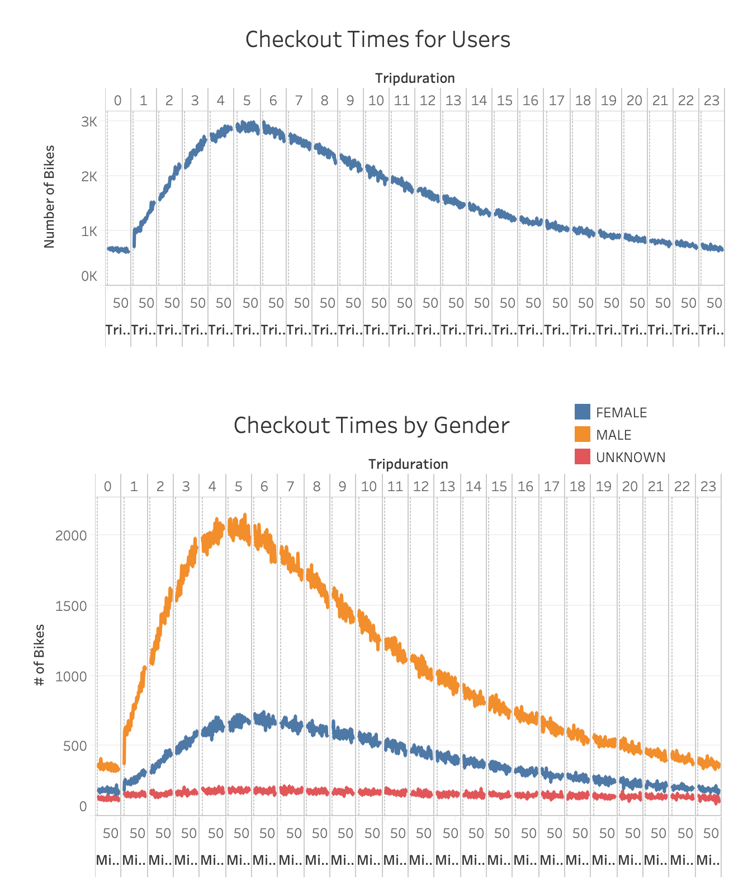

# bikesharing

Overview of the Project
The purpose of this project is to analyze NYC Citibike utilization and build visualizations that can help us learn more about the business and draw some conclusions around how to implement this business successfully in the city of Des Moines, Iowa for a new start up.

You can visit the Dashboard at this Link: [CitiBike Dashboard](https://public.tableau.com/profile/alex.beebe#!/vizhome/CitibikeStory/CitiBikeStory?publish=yes)

Results/Visualization:
The first slide shows the number of rides by trip duration broken down by hours and minutes and by gender. This data shows that men are more likely to ride bikes around NYC and by a significant margin. 

We then look at a heat map to see what most popular time is in regards to the day of the week. This is futher broken down by gender as well. This visualization shows us that bikes are more typically taken during rush hour times before and after the normal 9a-5p work day. This information shows us that the best time to do bike repairs would be late at night or very early in the morning. This information also backs up the last slide by showing that men are riding bikes at higher volume than their female counterparts. 

The third slide breaks down the usage by the type of user and the day of the week. People who subscribe to the service are riding the bikes significantly more than those who pay as they go with Thursday and Friday being the highest volume day of the week.

We then look at a comparitive map of Manhattan to see the popular locations for the trips to start and end. With this information, we can see that Manhattan is a hot spot for riders, which makes sense as it's population is dense and has many tourists every single day.

